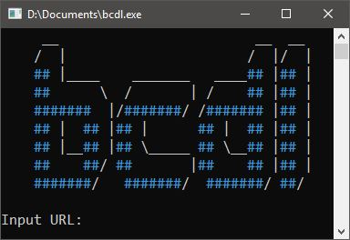

# bcdl

> Script to download free/pay what you want albums from Bandcamp



I was tired of scripts claiming to download "FLACs" from Bandcamp while in reality just ripping the 128kpbs MP3 preview streams the site uses. This script actually simulates "purchasing" the free/pay what you want albums and downloads them in the completely legal and free way that the average Joe would do at home, just faster and automated.

This also works with previously purchased releases by filling out the `config.yaml`.

You can use the flag `-b` to batch download from `download_links.txt`

**Syntax:** `bcdl.exe [<flags>] [<url>]`

**Quick Setup:**

1. Download `bcdl.exe` from [the releases tab](https://github.com/daot/bcdl/releases/latest)
2. Put the executable in the folder of your choice. The default download directory is a subfolder named `downloads`
3. _OPTIONAL:_ Fill out `config.yaml` with the information needed (instructions are provided in the file). This allows bcdl to download albums in your library.

**Compiling Yourself:**

1. Install go dependencies

```
"github.com/cheggaaa/pb"
"github.com/anaskhan96/soup"
"github.com/fatih/color"
"github.com/jinzhu/configor"
"github.com/tidwall/gjson"
"gopkg.in/alecthomas/kingpin.v2"
```

2. `go build bcdl.go`
